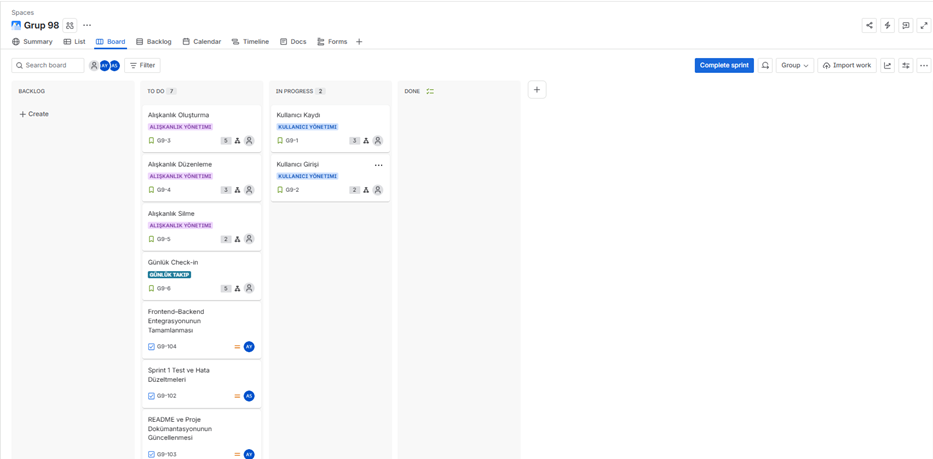
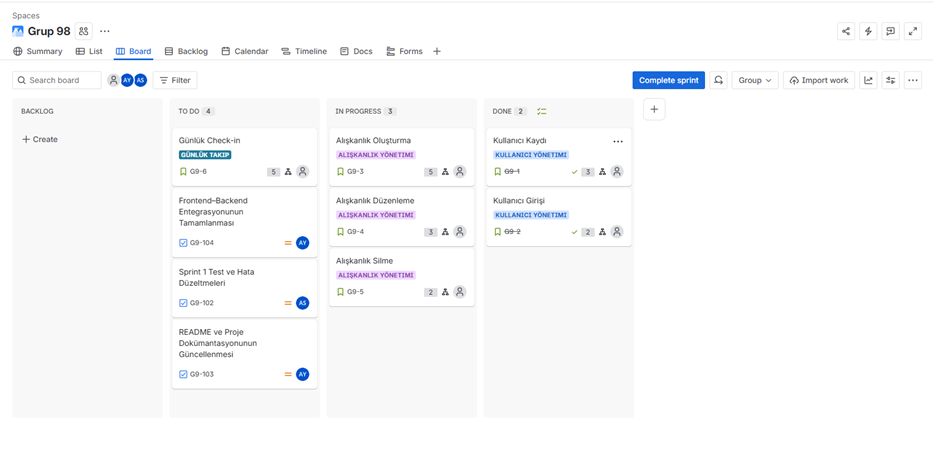
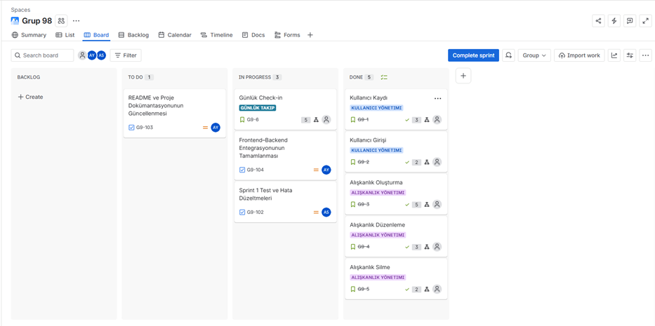
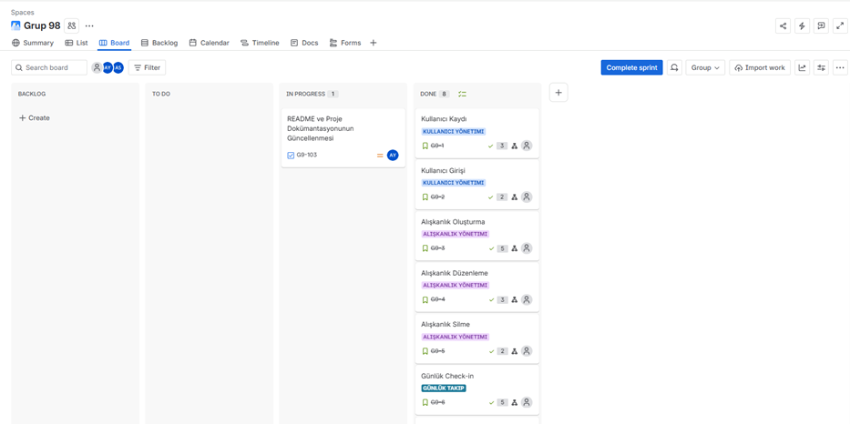
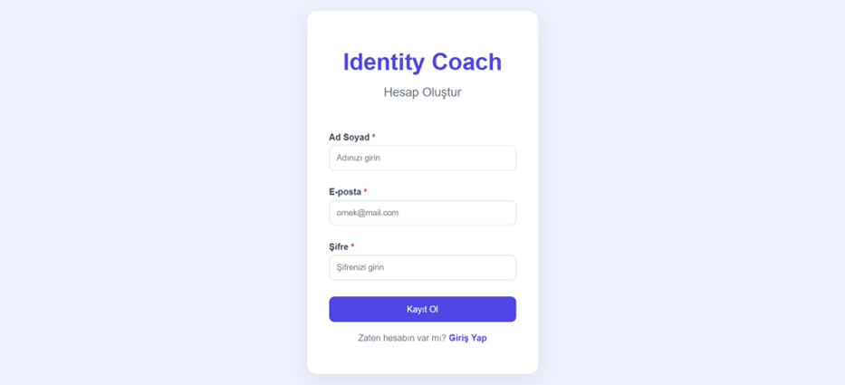
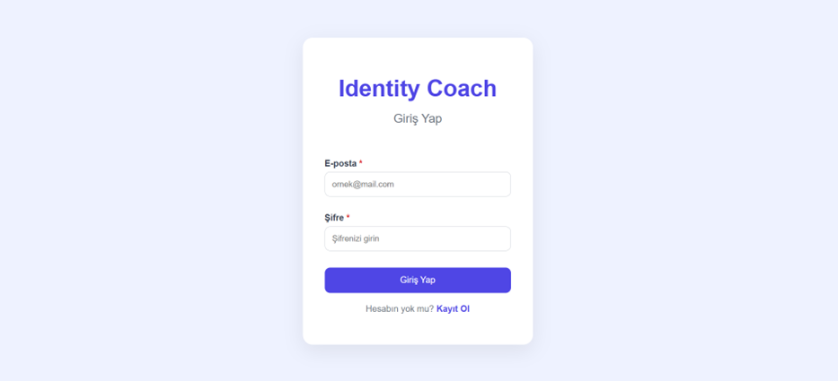
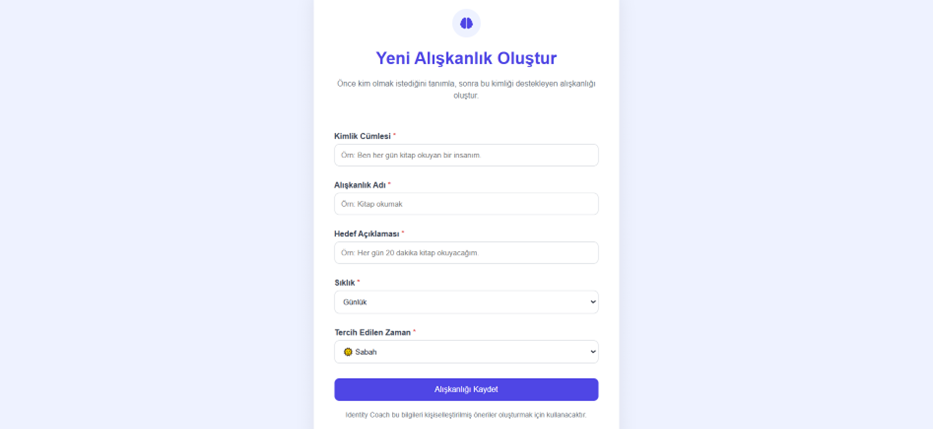
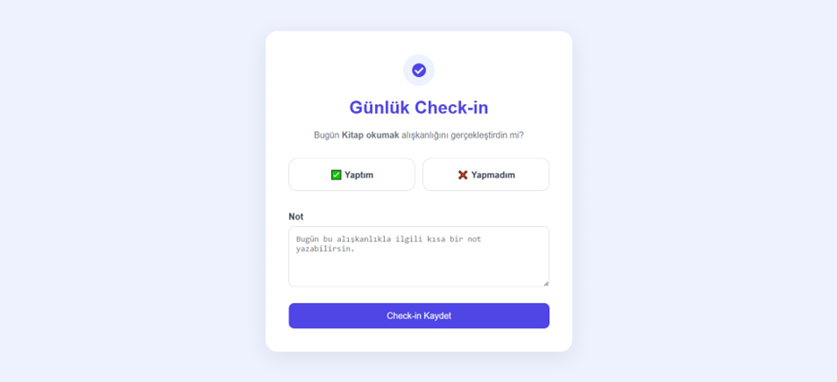
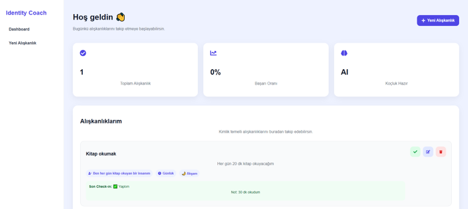

# 🧠 Habit Identity Coach

## Takım İsmi

**Takım 98**

---

# 👥 Takım Rolleri

| İsim | Rol |
|------|------|
| Ahmet Enes Selek| Product Owner |
| Aybüke Yıldız   | Scrum Master |
| Elif Ep         | Developer |
| Aren Keşiş      | Developer |

---

# 📌 Ürün İsmi

**Habit Identity Coach**

---

# 📖 Ürün Açıklaması

Habit Identity Coach, kullanıcıların yalnızca alışkanlıklarını takip etmelerini değil, sürdürülebilir davranış değişikliği oluşturarak olmak istedikleri kimliği inşa etmelerini amaçlayan yapay zekâ destekli bir alışkanlık koçudur.

Kullanıcıların günlük alışkanlıklarını takip eder, hedeflerine ulaşamadıkları durumlarda nedenlerini analiz eder ve davranış bilimi temelli kişiselleştirilmiş öneriler sunarak alışkanlıklarını kalıcı hale getirmelerine yardımcı olur.

---


# 💡 Değer Önerisi

Habit Identity Coach, geleneksel alışkanlık takip uygulamalarından farklı olarak yalnızca kullanıcının alışkanlıklarını kaydetmekle kalmaz, başarısızlık yaşanan anlarda da aktif rol üstlenir.

Yapay zekâ destekli analiz mekanizması, kullanıcının başarısızlık nedenlerini değerlendirerek geçmiş davranışlarını dikkate alır ve davranış bilimi temelli kişiselleştirilmiş stratejiler sunar. Böylece kullanıcıya yalnızca ilerlemesini gösteren bir takip aracı değil, sürdürülebilir alışkanlıklar geliştirmesine yardımcı olan dijital bir koç deneyimi sunulur.

---


# ✨ Ürün Özellikleri

- Kullanıcı kayıt ve giriş sistemi
- Kimlik temelli alışkanlık oluşturma
- Alışkanlık düzenleme ve silme
- Günlük Check-in sistemi
- Ruh hali takibi
- Yapay zekâ destekli başarısızlık analizi
- Kişiselleştirilmiş koçluk önerileri
- RAG destekli bilimsel strateji önerileri
- Haftalık gelişim raporları
- İstatistik ve ilerleme ekranı

---

# 🎯 Hedef Kitle

- Yeni alışkanlık edinmek isteyen bireyler
- Üniversite öğrencileri
- Yoğun çalışan profesyoneller
- Kişisel gelişim odaklı kullanıcılar
- Günlük rutinlerini sürdürülebilir hale getirmek isteyen herkes

---


# 🛠️ Kullanılan Teknolojiler

| Teknoloji | Kullanım Amacı |
|-----------|----------------|
| React & Vite | Kullanıcı arayüzünün geliştirilmesi |
| FastAPI | REST API geliştirme |
| PostgreSQL | Kullanıcı ve alışkanlık verilerinin saklanması |
| SQLAlchemy | ORM ve veritabanı yönetimi |
| JWT | Kimlik doğrulama ve oturum yönetimi |
| Gemini API | Yapay zekâ destekli koçluk ve öneri sistemi |
| RAG | Bilimsel stratejilerin kullanıcıya sunulması |
| Git & GitHub | Versiyon kontrolü ve ekip çalışması |
| Jira | Sprint ve görev yönetimi |

---


# 📋 Product Backlog

Product Backlog, ürünün geliştirme sürecinde gerçekleştirilecek tüm kullanıcı hikâyelerini, önceliklendirilmiş görevleri ve sprint planlamalarını içerecek şekilde hazırlanmıştır. Backlog, kullanıcıya değer katacak temel özellikler önceliklendirilerek üç sprint boyunca geliştirilecek şekilde planlanmıştır.Sprint 1 kapsamında geliştirilen kullanıcı hikâyeleri Jira üzerinden yönetilmiş ve sprint süreci boyunca takip edilmiştir. Her kullanıcı hikâyesi, ekip üyeleri arasında paylaştırılan alt görevlere (subtask) ayrılarak geliştirilmiştir.

🔗 **Product Backlog** *(Link eklenecek.)*

---

# 🚀 Sprint 1

## Sprint Notları

Sprint 1 kapsamında Habit Identity Coach uygulamasının ilk çalışabilir sürümü oluşturulmuştur. Kullanıcı kayıt ve giriş sistemi geliştirilmiş, kullanıcıların alışkanlık oluşturabilmesi, düzenleyebilmesi ve silebilmesi sağlanmıştır. Ayrıca günlük Check-in mekanizmasının temel altyapısı tamamlanarak uygulamanın temel kullanıcı akışı başarıyla oluşturulmuştur.

---

## Sprint İçinde Tamamlanması Planlanan Puan

**20 Story Point**

---

## Puan Tamamlama Mantığı

Sprint 1 backlog'u oluşturulurken uygulamanın çalışabilir ilk sürümünü oluşturacak kullanıcı hikâyelerine öncelik verilmiştir. Kullanıcının sisteme kayıt olabilmesi, giriş yapabilmesi, alışkanlık oluşturup yönetebilmesi ve günlük alışkanlık takibini gerçekleştirebilmesi ürünün temel fonksiyonları olarak değerlendirilmiştir. Bu doğrultuda toplam **20 Story Point**'lik geliştirme planlanmış ve sprint sonunda tamamlanmıştır.

---

## Sprint Backlog

Sprint 1 kapsamında geliştirilen kullanıcı hikâyeleri Jira üzerinden yönetilmiş ve sprint süreci boyunca takip edilmiştir.

[🔗 **Jira Board**](https://aybukeyildiz.atlassian.net/jira/software/projects/G9/boards/34?atlOrigin=eyJpIjoiMjgxMzU2NDYyMWMxNGU2MGFlZjY2NGJjOTU1MTE1ZGUiLCJwIjoiaiJ9)

---

## Daily Scrum Notları

Sprint boyunca ekip içi iletişim düzenli Daily Scrum toplantıları ile sürdürülmüş, görevlerin ilerleme durumu değerlendirilmiş ve karşılaşılan engeller ekip içerisinde çözülmüştür.

[🔗 **Daily Scrum Görselleri**](https://github.com/ahmetenes03/identity-coach/tree/aybuke/docs/sprint1/daily-scrum)

---

## Sprint Board Updates

Sprint süresince görevlerin ilerleyişi Jira Board üzerinden takip edilmiş ve görev durumları düzenli olarak güncellenmiştir.

📷 **Sprint Board ekran görüntüleri aşağıda yer almaktadır.**

<p align="center">
  
</p>

<p align="center">
  
</p>

<p align="center">
  
</p>

<p align="center">
  
</p>

---


## Ürün Durumu

Sprint sonunda uygulamanın temel kullanıcı akışı tamamlanmış ve aşağıdaki modüller geliştirilmiştir.

- Kullanıcı Kayıt
- Kullanıcı Giriş
- Alışkanlık Oluşturma
- Alışkanlık Düzenleme
- Alışkanlık Silme
- Günlük Check-in

📷 **Sprint sonunda geliştirilen ekranlara ait görseller aşağıda yer almaktadır.**


| Kayıt Ol | Giriş Yap |
|----------|-----------|
|  |  |

| Alışkanlık Oluştur | Günlük Check-in |
|--------------------|-----------------|
|  |  |

<p align="center">
  
</p>
---

## Sprint Review

Sprint 1 hedefleri başarıyla tamamlanmıştır. Kullanıcı yönetimi ve alışkanlık yönetimine ait temel kullanıcı hikâyeleri geliştirilmiş, günlük Check-in altyapısı oluşturulmuş ve ürünün ilk çalışabilir sürümü ortaya çıkarılmıştır. Sprint sonunda gerçekleştirilen değerlendirme toplantısında elde edilen çıktılar gözden geçirilmiş ve Sprint 2 kapsamında geliştirilecek yapay zekâ destekli koçluk özellikleri için önceliklendirme yapılmıştır.

---

## Sprint Retrospective

### 👍 İyi Gidenler

- Sprint kapsamı doğru belirlenerek planlanan kullanıcı hikâyeleri başarıyla tamamlandı.
- Ekip üyeleri arasındaki görev dağılımı dengeli şekilde yürütüldü.
- Düzenli iletişim sayesinde sprint sürecinde karşılaşılan problemler kısa sürede çözüldü.
- Ürünün temel kullanıcı akışı planlanan süre içerisinde tamamlandı.

### 🔄 Geliştirilebilecek Noktalar

- Story Point tahminlerinin doğruluğunu artırmak amacıyla sprint sonunda harcanan efor yeniden değerlendirilecektir.
- Kod inceleme ve test süreçleri Sprint 2'de daha erken aşamalarda gerçekleştirilecektir.
- Sprint boyunca oluşturulan teknik dokümantasyonun daha kapsamlı tutulması hedeflenmektedir.

---


# ⚙️ Kurulum

Projeyi yerel ortamda çalıştırmak için aşağıdaki adımları takip edebilirsiniz.

```bash
# Repository'yi klonlayın
git clone https://github.com/<repository-link>

cd Habit-Identity-Coach

# Backend kurulumu
cd backend

python -m venv .venv

# Windows
.venv\Scripts\activate

# macOS / Linux
source .venv/bin/activate

pip install -r requirements.txt

copy .env.example .env

alembic upgrade head

uvicorn app.main:app --reload

# Yeni terminal açın

# Frontend kurulumu
cd frontend

npm install

npm run dev
```

Kurulum tamamlandıktan sonra aşağıdaki adresler üzerinden uygulamaya erişebilirsiniz.

| Servis | Adres |
|--------|--------|
| Frontend | `http://localhost:5173` |
| Backend API | `http://127.0.0.1:8000` |
| Swagger UI | `http://127.0.0.1:8000/docs` |
| Health Check | `http://127.0.0.1:8000/health` |

---